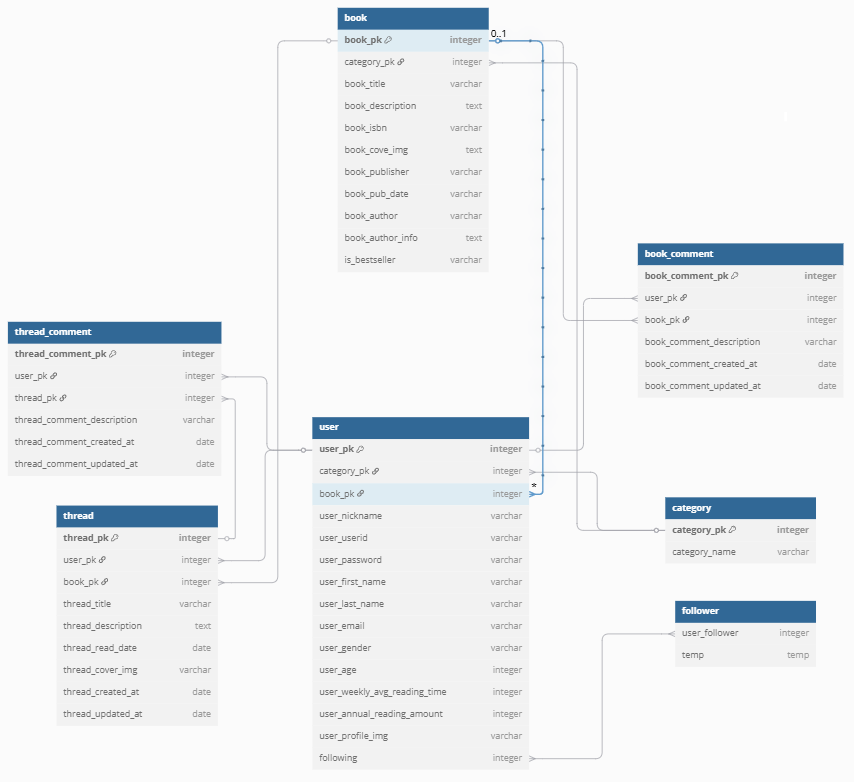
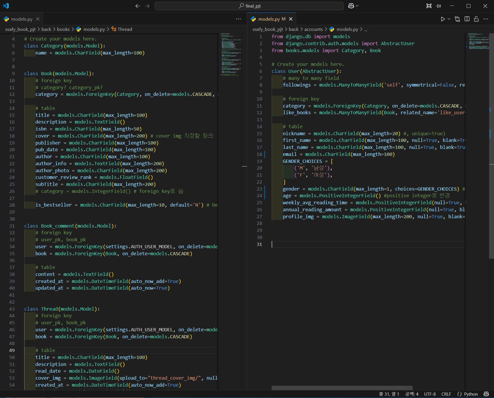
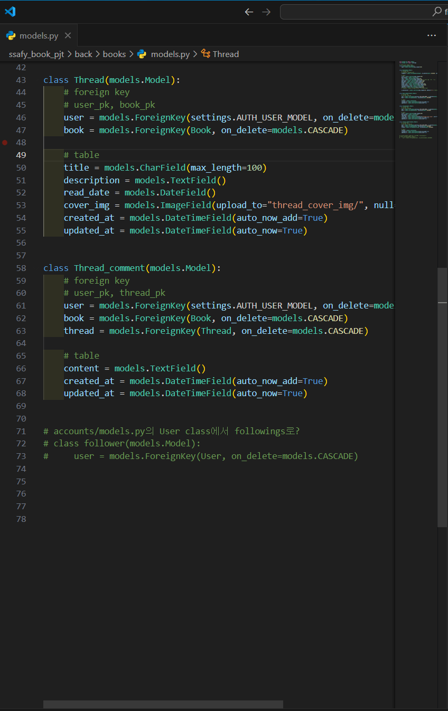

# BAA(Book All Around)
어디서든 책을 가까이 하는 문화를 지향

## 1. 목표 서비스 및 실제 구현 정도

### 목표 서비스
책을 가까이 하려면, 흥미에 맞는 도서를 추천받아야 한다.

1. 독서를 취미로 하는 다양한 사람들과 의견을 공유하고, 도서를 추천받을 수 있는 커뮤니티 공간을 생성하고자 한다.
2. 개인 프로필을 바탕으로 AI를 이용하여 도서를 추천하는 기능을 생성하고자 한다.

커뮤니티 공간은 크게 세 가지 공간으로 이루어져 있다.
- 도서에 대한 댓글 기능(개인 평점 제공 및 종합 평균 평점 확인 가능)
- 도서에 대한 쓰레드 기능
- 쓰레드에 대한 댓글 기능

    + 쓰레드에는 독후감과 비슷한 구성으로 이루어져, 평점 기능은 고려하지 않았다.

    + 쓰레드의 댓글 또한 의견에 대한 의견이기에, 평점 기능은 고려하지 않았다.

    + 오직 도서 상세정보 페이지의 댓글만 평점을 매길수 있게 하려한다.

메인 화면의 상단에는 사이트의 메인 사진(ai를 이용해 생성)을 띄우고, BAA라는 사이트와 한 줄 설명을 적으려 한다.    \
전체 도서 리스트 / 전체 쓰레드 리스트 / 추천 도서 리스트. 이 3가지 리스트를 '더보기' 버튼과 함께 한 줄의 캐러셀로 생성하려고 한다.

개인 프로필 페이지에는 다음과 같은 정보가 들어가게 하려 한다.
- id, pwd, 이름(성 이름), 성별, 나이, 주간 독서 시간(시간), 연간 독서량(권), 찜한 도서 목록

이 중 '성별, 나이, 찜한 도서 목록' 3가지 항목을 바탕으로 ai가 도서를 추천해주는 기능을 제공하고자 한다.

도서 리스트를 보여주는 페이지 생성  \
본 페이지에는 도서 전체를 보여주는 체크박스가 기본으로 설정되어 있으며, 카테고리별로 체크박스가 나누어져 있다.  \
도서가 많으면, 페이지 렌더링 시 렉을 유발할 수 있기에 '+ 더보기' 기능을 구현하여 적당한 양의 도서만 먼저 보여주고자 한다.

### 실제 구현
- 메인 화면: 사이트의 메인 사진(구현 x. 간단한 이미지와 텍스트로 대체), 전체 도서 / 쓰레드 / 추천 도서 3가지 리스트(구현 x)

- 커뮤니티 공간: 쓰레드 생성(구현 완료), 쓰레드 댓글(구현 완료), 도서 댓글 및 평점(댓글만 구현 완료, 평점은 구현 x)

- 개인 프로필: id, pwd, 이름 등 기본 정보와, 찜한 도서 목록을 보여는 프로필 화면 구현 완료

- 도서 리스트 페이지: 카테고리별로 나누기(구현 완료), 더보기 기능(구현 x)

- AI기반 도서 추천 기능(구현 완료)

## 2. 팀원 정보 및 업무 분담
**곽주혜(팀장)**, 김영훈(팀원)

크게 back-end <-> front-end 분야로 업무를 나누었다.

- 곽주혜(front-end)
vue를 이용하여 front-end 작업을 하였다.

- 김영훈(back-end)
django를 이용하여 back-end 작업을 하였다.

## 3. ERD

초기에 작성한 ERD 사진이다. \
필드 속성, 참조 관계 등이 상당히 많이 변하였다. \
(아래 모델 사진 참고)

## 4. 도서 추천 기능

## 5. 핵심 기능

## 6. 생성형 ai를 활용한 부분

## 7. 기타(느낀점, 후기, 공부한 내용(git) 등)

